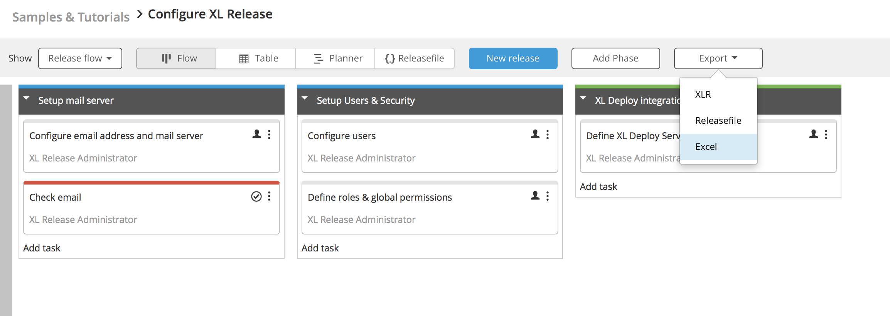
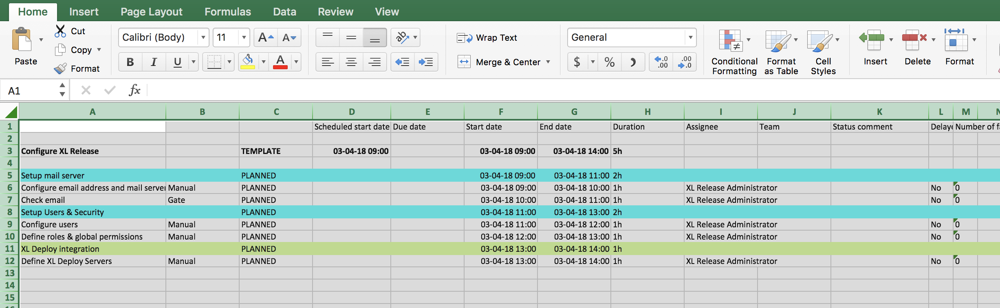
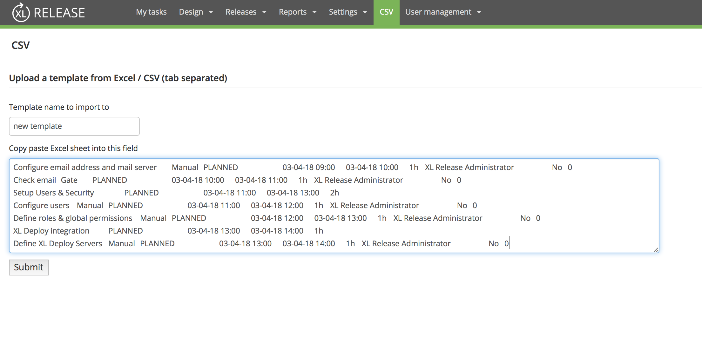
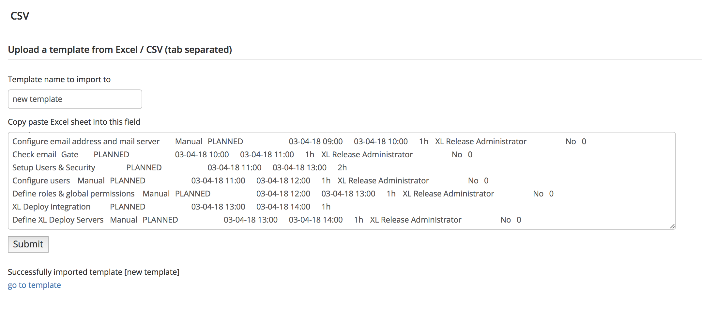
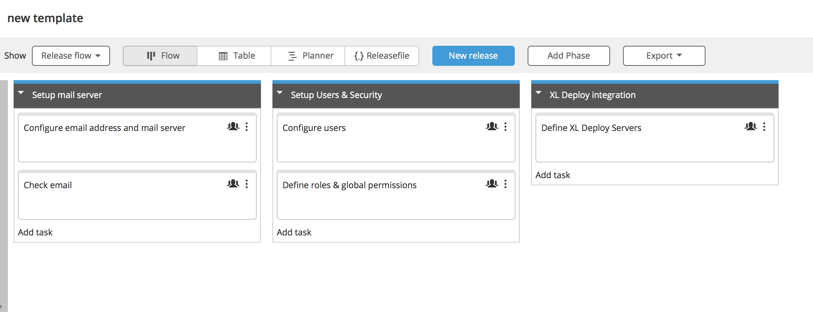

# xlr-csv-import-plugin

## Introduction: ##
This plugin will allow you to import simple, custom Excel spreadsheets into templates in XL Release.

## CI status ##

[![Build Status][xlr-csv-import-plugin-travis-image] ][xlr-csv-import-plugin-travis-url]
[![License: MIT][xlr-csv-import-plugin-license-image] ][xlr-csv-import-plugin-license-url]

[xlr-csv-import-plugin-travis-image]: https://travis-ci.org/xebialabs-community/xlr-csv-import-plugin.svg?branch=master
[xlr-csv-import-plugin-travis-url]: https://travis-ci.org/xebialabs-community/xlr-csv-import-plugin
[xlr-csv-import-plugin-license-image]: https://img.shields.io/badge/License-MIT-yellow.svg
[xlr-csv-import-plugin-license-url]: https://opensource.org/licenses/MIT

## Installation requirements ##

- XL Release 7.2.x
- higher versions are currently unsupported due to an issue that is being resolved in 7.6 - will hopefully follow with a hotfix.

## Installation: ##

Copy the plugin file to the XL Release plugin folder and restart the XL Release server. 

## Usage ##

Although this plugin is very easy adaptable to your own spreadsheet format, it's made to import whatever XL Release export:


You can edit it in Excel, select the entire workbook and copy it to your clipbard


Click on the CSV menu item. You can name the new template and paste the fields into the text area.


XL Release will give you a link to the imported template.


As you see, the imported template is not one-to-one, but it's a good 80%.


Fields currently supported: see ```field_to_column_index_mapping``` in [CsvParser.py](src/main/resources/csv_import/CsvParser.py).


## Testing ##

Unittests are ran by gradle as part of the lifecyle ```./gradlew test```. This only tests the CsvParser though. UPDATE THE UNITTESTS IF YOU EXPAND THIS PLUGIN!


